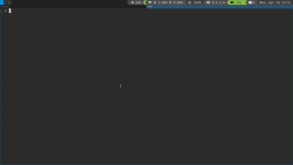

# Bitwarden-menu

Dmenu/Rofi frontend for managing Bitwarden vaults. Uses the [Bitwarden CLI][2]
tool to interact with the Bitwarden database.

This project is not associated with the Bitwarden project nor 8bit Solutions
LLC.

## Installation

`pip install --user bitwarden-menu`

Ensure `~/.local/bin` is in your `$PATH`. Run `bwm` and enter your database
path, keyfile path, and password.

**NOTE:** _Initial login to some servers, including vault.bitwarden.com, will
require the `client_secret` from your account settings page. Ensure this is in
your clipboard and ready to paste prior to first run.  Once logged in for the
first time, you will not need this value again._
 
For full installation documention see the [installation docs][docs/install.md].

## Full Documentation

[Installation](docs/install.md) - [Configuration](docs/configure.md) - [Usage](docs/usage.md)

## Requirements

1. Python 3.7+
2. [Bitwarden CLI][2]. Ensure the `bw` command is in `$PATH`
3. [Pynput][1] and [Xdg][6]
4. Dmenu, [Rofi][3], [Wofi][7] or [Bemenu][4]
5. xsel or wl-copy
6. (optional) Pinentry.
7. (optional) xdotool, ydotool(>= 1.0.0)/wtype (for Wayland).

## Features

- Supports multiple [bitwarden.com](https://bitwarden.com) and self-hosted
  [Vaultwarden][5] accounts. Accounts can be switched on the fly.
- Auto-type username and/or password on selection. Select to clipboard if
  desired (clipboard clears after 30 sec on X11 or after 1 paste on Wayland).
- Supports login with 2FA code from Authenticator(TOTP), Email, or Yubikey.
- Background process allows selectable time-out for locking the database.
- Use a custom [Keepass 2.x style auto-type sequence][6].
- Type, view or edit any field.
- Open the URL in the default web browser.
- Non U.S. English keyboard languages and layouts supported via xdotool or
  ydotool/wtype (for Wayland).
- Edit notes using terminal or gui editor.
- Add and Delete entries
- Rename, move, delete and add folders and collections
- Move any item to or from an organization, including support for multiple
  collections.
- Hide selected folders from the default and 'View/Type Individual entries'
  views.
- Configure the characters and groups of characters used during password
  generation.
- Optional Pinentry support for secure passphrase entry.
- Add, edit and type TOTP codes.

## License

- MIT

## Usage

`bwm [-h] [-v VAULT] [-l LOGIN] [-k] [-a AUTOTYPE] [-C]`

- Run `bwm` or bind to keystroke combination.
- Enter account URL on first run.
- Start typing to match entries.
- [Configure](docs/configure.md) ~/.config/bwm/config.ini as desired.
- More detailed [usage information](docs/usage.md).
- Screencast (Using Bemenu on Sway):

## Tests

To run tests in a venv: `make test` (not implemented yet)

## Development

- To install bitwarden-menu in a venv: `make`
- Build man page from Markdown source: `make man`
- Using `hatch`:
    - `hatch shell`: provies venv with editable installation.
    - `hatch build` && `hatch publish`: build and publish to Pypi.
- Using `nix`:
    - `nix develop`: Provides development shell with all dependencies.
    - `make test` and `hatch build/publish` work as usual.

## Planned features

- Unit tests
- Notifications for syncing status (e.g. when a sync is complete)

[1]: https://github.com/moses-palmer/pynput "Pynput"
[2]: https://github.com/bitwarden/cli "Bitwarden CLI"
[3]: https://davedavenport.github.io/rofi/ "Rofi"
[4]: https://github.com/Cloudef/bemenu "Bemenu"
[5]: https://github.com/dani-garcia/vaultwarden "Vaultwarden"
[6]: https://pypi.org/project/xdg/ "Xdg"
[7]: https://hg.sr.ht/~scoopta/wofi "Wofi"
